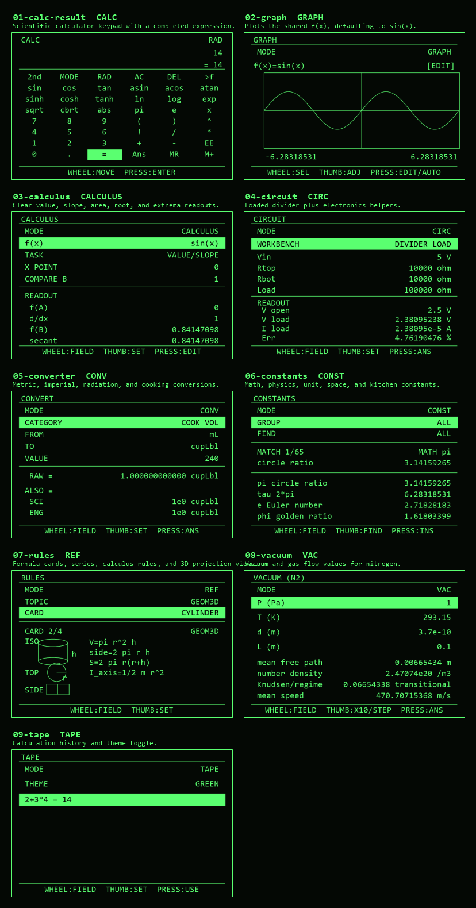
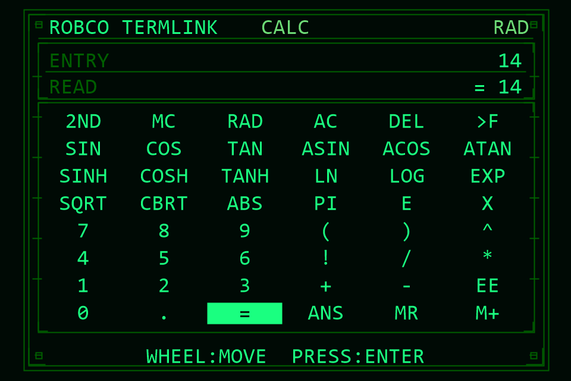
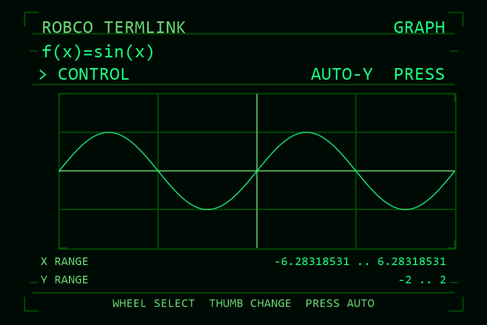
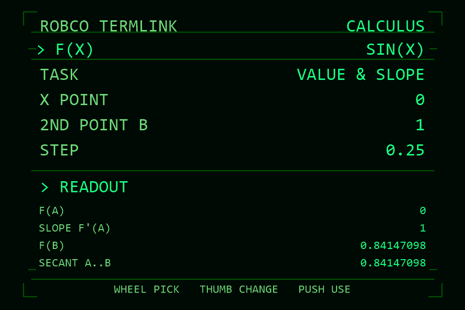
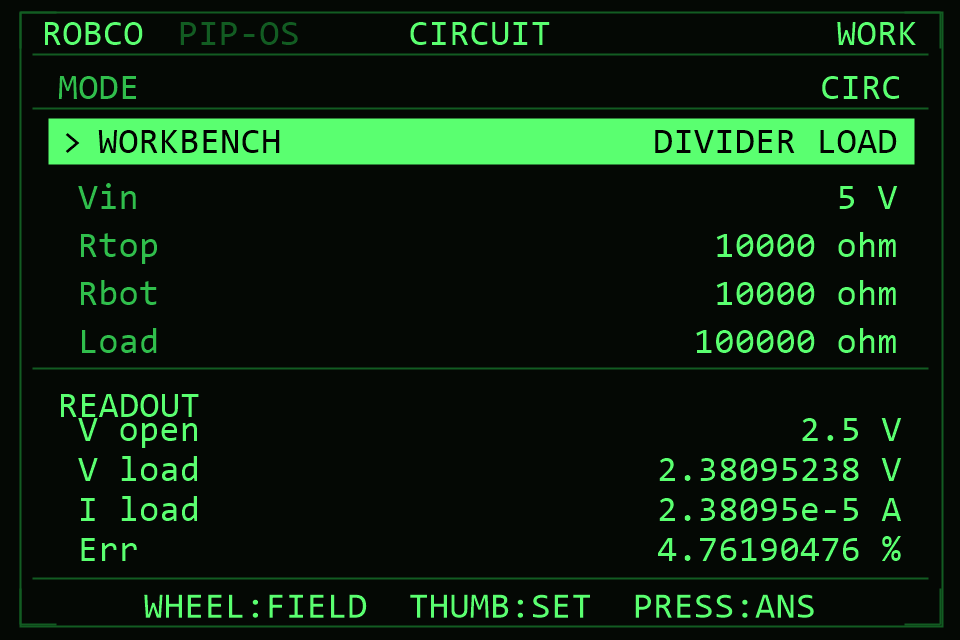
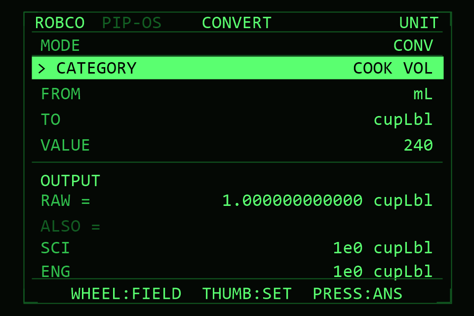
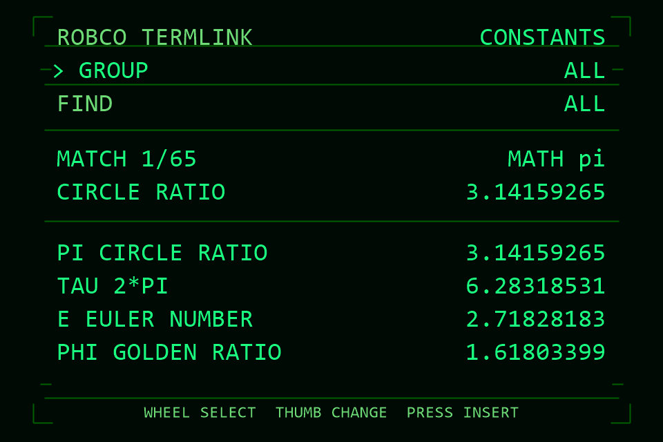
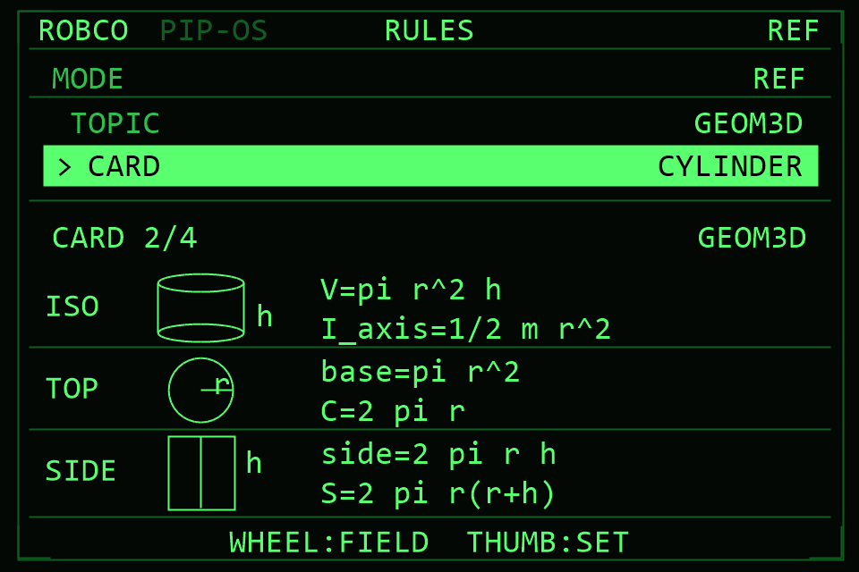
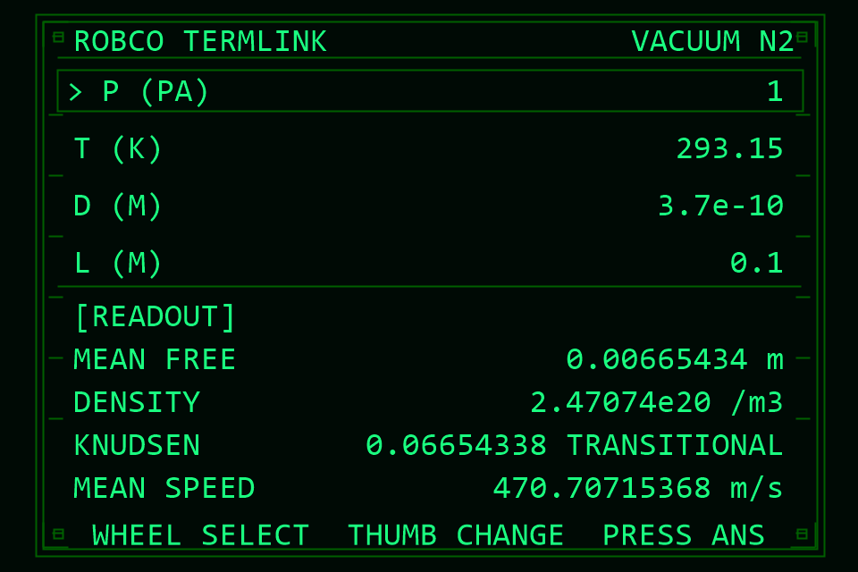
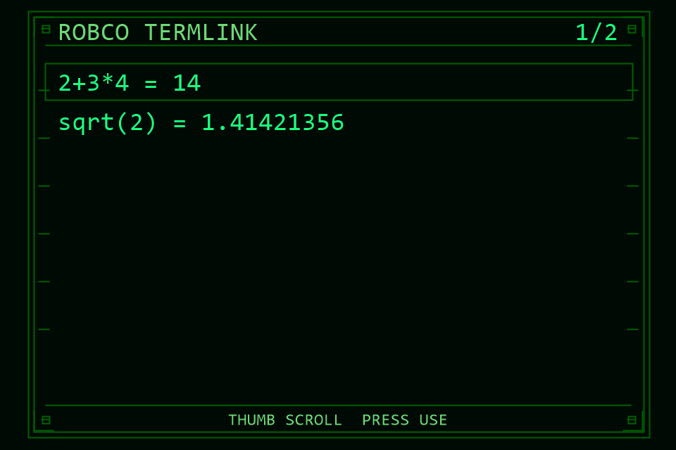

# RobCo Calculator

RobCo Calculator is a Pip-Boy style engineer's calculator suite for the Pip runtime. It installs as **nine independent apps** — a scientific calculator, graphing view, calculus tools, electronics helpers, unit conversions, constants, reference formulas, vacuum calculations, and a calculation tape — each its own 480x320 fullscreen launcher tile. They share `f(x)`, `Ans`, memory, angle mode, and history through a small state file on the card, so values flow between them without bundling everything into one resident app.

<p align="center">
  
</p>

## Features

- **CALC**: scientific keypad with trig, inverse trig, hyperbolic functions, logs, roots, powers, factorials, `Ans`, memory recall, and `RAD` / `DEG` angle modes.
- **GRAPH**: plots the shared `f(x)` expression, with controls for edit, zoom, and pan.
- **CALCULUS**: evaluates `f(x)`, numerical slope, Simpson-rule area, roots near a guess, and extrema.
- **CIRC**: electronics workbench for dividers, Ohm/power, resistor networks, LED limits, RC/RL filters, LC tanks, reactance, 555 timers, op amps, ADC scale, wire drop, and resistor color values.
- **CONV**: unit converter covering pressure, length, mass, cooking units, area, volume, temperature, energy, power, force, time, speed, data, angle, frequency, acceleration, torque, density, flow, charge, resistance, capacitance, inductance, magnetic field, and radiation units.
- **CONST**: searchable constants for math, physics, electrical, thermal, unit, material, Earth, space, and cooking references.
- **REF**: formula cards for logs, algebra, derivatives, integrals, series, geometry, vectors, electrical formulas, and mechanics.
- **VAC**: nitrogen vacuum helper for mean free path, number density, Knudsen regime, and mean molecular speed.
- **TAPE**: recent calculation history plus staged-value recall.

## Controls

Each app uses the Pip runtime's two rotary inputs:

- **Calc**: wheel selects keypad rows, thumb selects keypad columns, press activates the highlighted key.
- **Tool applets**: wheel selects the highlighted row, thumb changes that row, press runs the row's explicit action such as import `Ans`, insert a constant, use a tape value, or auto-scale the graph.

The apps use the Pip runtime's current display color; there is no in-app theme control.

The `Calc`, `Graph`, and `Calculus` apps share the same `f(x)` expression: build an expression in `Calc` and press `>f` to publish it, then open `Graph` or `Calculus` to plot or analyze it. `Constants` and `Tape` stage a value into the shared state; the next time you open `Calc` it inserts that value. Evaluated results are stored in `Ans` and the tape and are available to the other apps.

## How It Works

Each mode is its own Pip launcher app — a self-contained file that returns a Pip app factory which registers `knob1` / `knob2` handlers, draws the fullscreen interface through the Pip graphics helper `h`, and (for the math apps) parses expressions with a small recursive-descent evaluator, differentiates with central differences, integrates with Simpson's rule, and solves roots/extrema with Newton-style searches. There is **no in-app mode menu and no cross-app `load()` navigation** — you open each app directly from the Pip launcher, and only one app is ever resident.

- `APPS/PIPCALC.JS` — scientific keypad (`Calc`, the home app)
- `APPS/PGRAPH.JS` — function plotter (`Graph`)
- `APPS/PCALCULUS.JS` — numeric calculus (`Calculus`)
- `APPS/PCIRC.JS` — circuit workbench (`Circuit`)
- `APPS/PCONV.JS` — unit converter (`Convert`)
- `APPS/PCONST.JS` — constants (`Constants`)
- `APPS/PREF.JS` — reference formula cards (`Reference`)
- `APPS/PVAC.JS` — vacuum tools (`Vacuum`)
- `APPS/PTAPE.JS` — calculation tape (`Tape`)

**Shared state** (`f(x)`, `Ans`, memory, angle mode, history, and a value staged for `Calc`) lives in the `CALCST` file on the card via `require("Storage")`. Each app reads it on launch and writes it back on exit, so values flow between apps even though only one runs at a time.

Espruino keeps each function's source text resident in RAM, so file size is essentially RAM cost. The shared helpers (`src/_LIB.JS`) and evaluator (`src/_EVAL.JS`) are **inlined into each app at build time** at every `//@inject` marker, so each shipped `APPS/*.JS` is standalone — the duplicated bytes cost card space, not RAM. The readable source lives in `src/`; the device files in `APPS/` are the **minified build** produced by `tools/build.js` (terser), which is what lets each app launch without `ERROR Errors: CALLBACK, LOW_MEMORY, MEMORY`. Edit `src/` and re-run `npm run build`; never hand-edit `APPS/`.

Each app has its own metadata file in `APPINFO/` (`CALC.info`, `GRAPH.info`, …) naming the app, version, source file, and install payload for the Pip launcher.

## Installation

### Browser installer

1. Open `install.html` in Chrome or Edge.
2. Select the root of the microSD card used by your Pip runtime.
3. Click **Install**.

The installer reads the payload list from all nine `APPINFO/*.info` manifests, downloads the files from this GitHub repository, and writes them into matching `APPS/` and `APPINFO/` folders on the selected card. If your browser does not offer folder write access, use the manual steps below.

**Purge any previous install** is on by default: before writing, the installer reads any of the nine `APPINFO/*.info` manifests already on the card, deletes every file those older versions listed (plus the current payload), and then writes a clean copy. This avoids stale files from an earlier version conflicting with the new one. Uncheck it to install without clearing.

If the direct install fails (some SD-card/OS combinations throw `NotReadableError` from the browser's File System Access API), click **Download .zip** instead. It bundles the same payload into `RobCo-Calculator.zip`; extract that to the microSD root and it creates the `APPS/` and `APPINFO/` folders for you. This path writes no files directly, so it works in any browser.

### Manual install

1. Connect or mount the device storage used by your Pip runtime.
2. Copy all nine app files (`APPS/PIPCALC.JS`, `APPS/PGRAPH.JS`, `APPS/PCALCULUS.JS`, `APPS/PCIRC.JS`, `APPS/PCONV.JS`, `APPS/PCONST.JS`, `APPS/PREF.JS`, `APPS/PVAC.JS`, `APPS/PTAPE.JS`) into the device's `APPS/` directory.
3. Copy all nine manifests (`APPINFO/CALC.info`, `APPINFO/GRAPH.info`, `APPINFO/CALCULUS.info`, `APPINFO/CIRC.info`, `APPINFO/CONV.info`, `APPINFO/CONST.info`, `APPINFO/REF.info`, `APPINFO/VAC.info`, `APPINFO/TAPE.info`) into the device's `APPINFO/` directory.
4. Restart, rescan, or reload the Pip launcher.
5. Open **Calc** (and any of the other tiles) from the app list.

The apps ship no npm packages; the runtime must provide the global `Pip` API and graphics helper `h`, so opening an `APPS/*.JS` file directly in a browser or Node.js will not launch it. Each app is self-contained — you can install only the tiles you want — but `Graph` and `Calculus` read the `f(x)` you set in `Calc`, so they are most useful installed together.

### Building from source

The device files in `APPS/` are generated from `src/` and are committed so the
installer can fetch them directly. To rebuild after editing `src/`:

1. `npm install` — installs the only dev dependency, `terser`.
2. `npm run build` — minifies `src/*.JS` into `APPS/*.JS`.
3. `npm run verify` — confirms the minified build renders byte-for-byte
   identically to the source (drives the headless harness over every screen).

## Preview Images

The `screenshots/` directory contains generated previews for the main screens:

| Screen | Preview |
| --- | --- |
| Calculator |  |
| Graph |  |
| Calculus |  |
| Circuit tools |  |
| Converter |  |
| Constants |  |
| Reference rules |  |
| Vacuum tools |  |
| Tape |  |

To regenerate previews on Windows with Node.js and PowerShell:

```powershell
powershell -ExecutionPolicy Bypass -File tools/render-previews.ps1 -Scale 2
```

The capture script evaluates the app in a small mocked Pip environment, records drawing operations, and renders PNG files plus `screenshots/preview-contact-sheet.png`.

## Repository Layout

```text
src/_LIB.JS              Shared helpers (drawing, theming, CALCST state, bootstrap) inlined into each app
src/_EVAL.JS             Shared expression evaluator inlined into the math apps
src/P*.JS                Readable source for each app (built into APPS/ by tools/build.js)
APPINFO/*.info           One launcher manifest per app (CALC, GRAPH, CALCULUS, CIRC, CONV, CONST, REF, VAC, TAPE)
APPS/PIPCALC.JS          Calc — scientific keypad (home app)
APPS/PGRAPH.JS           Graph — function plotter
APPS/PCALCULUS.JS        Calculus — numeric value/slope/area/roots/extrema
APPS/PCIRC.JS            Circuit — electronics workbench
APPS/PCONV.JS            Convert — unit converter
APPS/PCONST.JS           Constants — searchable constants
APPS/PREF.JS             Reference — formula + geometry cards
APPS/PVAC.JS             Vacuum — nitrogen vacuum tools
APPS/PTAPE.JS            Tape — history
screenshots/             Generated README previews
tools/build.js           Inlines fragments + minifies src/ into APPS/
tools/capture-preview-ops.js
tools/verify-build.js    Confirms APPS/ renders identically to src/
tools/render-previews.ps1
```
